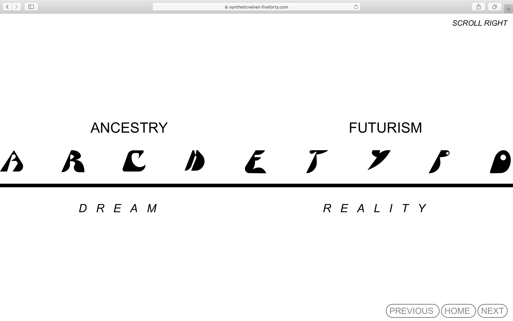

# Five-Forty - creative website for magazine

[FIVE FORTY](https://www.syntheticvelvet-fiveforty.com/) is a creative website with interactive UX. It was made for an online magazine project. 

## Features

This website features creative works created by contributors from diverse disciplines (photography, video, digital design, writing). All the works are inspired by the time 5:40 am.   

## Credits

My role involved designing and developing the website as well as coordinating its production while collaborating with contributors.  

creative content contributors: Camila Ayala, Helene Belaunde, Audrey Kadjar, Linhui Li, Gulce Masrabaci, Eduardo Taborda

## Tech

**Stack**: HTML, CSS, JavaScript, jQuery  

## Visuals

