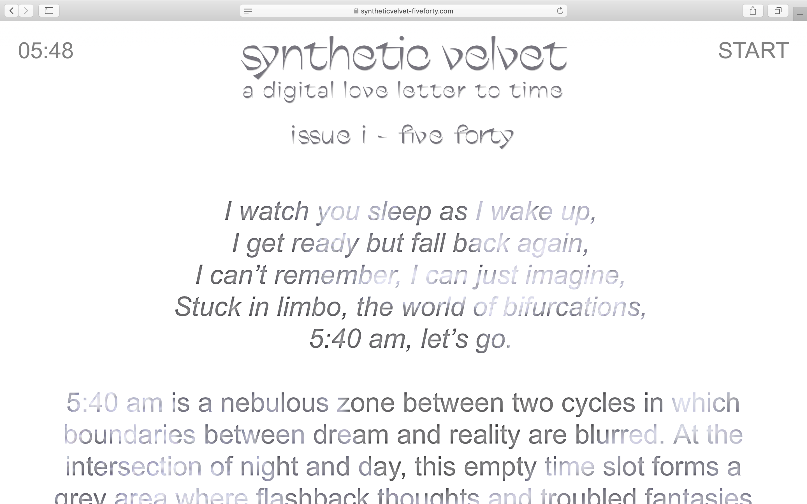

# Five-Forty

[FIVE FORTY](https://www.syntheticvelvet-fiveforty.com/) is a creative website themed around the hour 5:40 am. it features creative works, all inspired by this time.  
This website is the first issue of online magazine synthetic velvet, which explores the concept of time. Each issue takes the form of a website and is themed around one specific hour.  

Since launching, synthetic velvet has been exhibited as a part of the Vorspiel program organized by digital culture festivals CTM and Transmediale as well as in the [VABF exhibition in Vancouver](http://vancouverartbookfair.com/19/about/).  

Check out the project's second issue: [3:10 PM ](https://www.syntheticvelvet-threeten.com/) 
