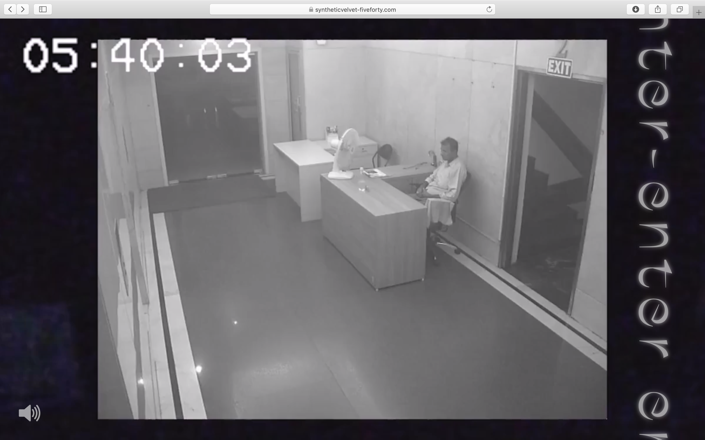

# Five-Forty - creative website for magazine

[FIVE FORTY](https://www.syntheticvelvet-fiveforty.com/) is a creative website inspired by the time 5:40 am. It is the first issue of online magazine synthetic velvet.

synthetic velvet is a creative project which explores the concept of time. Each issue takes the form of a website and is themed around one specific hour.

Since launching, synthetic velvet has been exhibited as a part of digital culture program Vorspiel organized by festivals CTM and Transmediale in Berlin as well as in design exhibition [VABF](http://vancouverartbookfair.com/19/about/) in Vancouver.

Check out the project's second issue: [3:10 PM ](https://www.syntheticvelvet-threeten.com/) 

## Features

This website features creative works created by contributors from diverse disciplines (photography, video, digital design, writing). All the works are inspired by the time 5:40 am.   
The website features a creative, interactive design for a unique user experience.

## Credits

My role involved designing and developing the website as well as coordinating its production collaborating with contributors.  

creative content contributors: Camila Ayala, Helene Belaunde, Audrey Kadjar, Linhui Li, Gulce Masrabaci, Eduardo Taborda

## Tech

**Stack**: HTML, CSS, JavaScript, jQuery  

## Visuals

